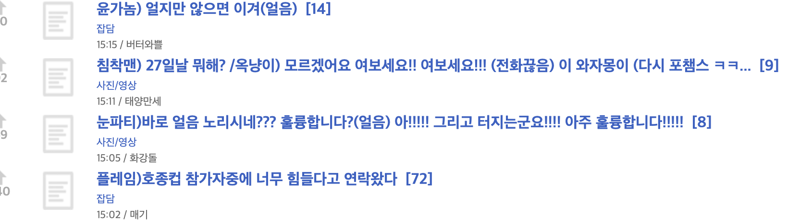
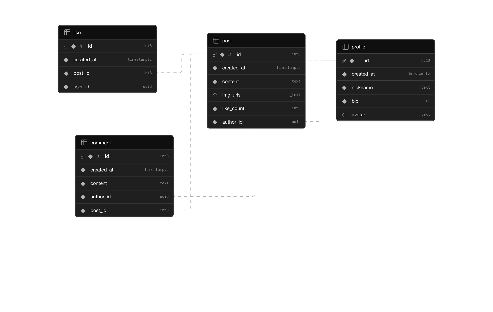

# ONAIR Forum

치지직 스트리머 관련 게시글을 작성하고, 댓글·좋아요·프로필 관리·미디어 업로드를 지원하는 커뮤니티 서비스입니다.

이 프로젝트는 단순 CRUD를 넘어서 **인증, 권한 제어(RLS), 스토리지 업로드, 서버 상태 관리, 무한 스크롤**까지 포함한 실서비스형 프론트엔드 프로젝트를 목표로 개발했습니다.

## 프로젝트 기획 계기



- 평소 이용하던 서비스가 라이브서비스에 다소 불편하고 각 스트리머의 현재 라이브 유무가 파악이 되지 않아 개선을 필요함을 느꼈습니다.

## 배포 링크

- 서비스: [https://onair-forum.vercel.app/](https://onair-forum.vercel.app/)
- 테스트 계정: `123@123.com / 123456`

## 프로젝트 소개

기존에는 UI 유지보수 중심의 업무를 주로 경험했기 때문에, 이번 프로젝트에서는 단순 화면 구현을 넘어 인증, 권한 제어, 업로드, 비동기 데이터 흐름까지 포함한 실서비스 구조를 직접 구현하는 데 집중했습니다.

특히 아래 영역을 실제로 다뤄보는 것을 목표로 했습니다.

- 사용자 인증 및 세션 관리
- 게시글 / 댓글 / 좋아요 데이터 흐름 설계
- 이미지·영상 업로드와 스토리지 연동
- React Query 기반 서버 상태 관리
- Supabase RLS를 활용한 권한 제어
- 외부 API 연동 시 CORS 대응을 위한 Edge Function 적용

## 주요 기능

### 인증

- 이메일 회원가입 / 로그인
- Google OAuth 로그인
- 비밀번호 재설정

### 게시글

- 게시글 작성 / 수정 / 삭제
- 이미지 및 영상 업로드
- 무한 스크롤 기반 게시글 목록 조회
- 게시글 상세 페이지 제공

### 댓글

- 댓글 작성 / 수정 / 삭제
- 대댓글 작성
- 게시글별 댓글 수 표시

### 좋아요

- 좋아요 추가 / 취소
- 낙관적 업데이트 적용
- RPC를 활용한 동시성 대응

### 프로필

- 프로필 이미지 변경
- 닉네임 / 소개 수정
- 특정 사용자의 게시글 모아보기

### 스트리머 연동

- 게시글 작성 시 채널 태그 선택
- 채널 라이브 상태 확인 기능 연동

## 기술 스택

### Frontend

- React
- TypeScript
- Vite
- Tailwind CSS
- shadcn/ui
- React Router

### State / Data Fetching

- TanStack Query
- Zustand

### Backend / Infra

- Supabase Auth
- Supabase Database
- Supabase Storage
- Supabase Edge Functions

### Deployment

- Vercel

## 기술 선택 이유

React
컴포넌트 단위로 UI를 분리하고 재사용 가능한 구조를 만들기 위해 사용했습니다.

TanStack Query
서버 상태와 클라이언트 상태를 분리하고, 캐싱 / 무한 스크롤 / 비동기 로딩 상태를 효율적으로 관리하기 위해 사용했습니다.

Zustand
모달 상태, 세션 관련 UI 상태처럼 전역에서 가볍게 관리해야 하는 상태를 처리하기 위해 사용했습니다.

Supabase
인증, 데이터베이스, 스토리지를 빠르게 구축할 수 있어 MVP 개발에 적합하다고 판단했습니다.
또한 RLS를 통해 사용자 권한 제어를 직접 구현해볼 수 있다는 점도 선택 이유였습니다.

## 폴더 구조

```bash
src
├─ api              # 외부 통신, Supabase/Edge Function 호출
├─ components       # 화면 단위 UI 컴포넌트
├─ hooks
│  ├─ mutations     # 생성/수정/삭제 관련 훅
│  └─ queries       # 조회 관련 훅
├─ lib              # 상수, 유틸, 공통 함수
├─ pages            # 라우트 페이지
├─ provider         # 세션/모달 provider
├─ store            # zustand 전역 UI 상태
└─ types.ts         # 공통 타입
```

## DB 구조



## 아키텍처 포인트

### 1. 서버 상태와 UI 상태를 분리

- 서버 데이터: TanStack Query
- 전역 UI 상태: Zustand

서버에서 가져오는 데이터와 모달/테마 같은 UI 상태를 분리해 관심사를 나눴습니다.

### 2. 좋아요 기능에 RPC 적용

좋아요 토글은 단순 클라이언트 상태 변경이 아니라, 서버에서 원자적으로 처리되도록 RPC를 사용했습니다. 이 과정에서 낙관적 업데이트를 함께 적용해 사용자 반응성을 높였습니다.

### 3. 무한 스크롤 + 개별 캐시 정규화

목록은 `useInfiniteQuery`로 관리하고, 개별 게시글은 별도 캐시에 저장해 상세 화면이나 다른 화면에서 재사용할 수 있도록 구성했습니다.

### 4. 외부 API CORS 대응

치지직 API는 클라이언트에서 직접 호출할 때 CORS 이슈가 발생할 수 있어, Supabase Edge Function을 사용해 서버 측에서 중계하도록 구성했습니다.

### 5. 권한 제어(RLS)

사용자 본인만 게시글/댓글/프로필을 수정·삭제할 수 있도록 RLS 정책을 설정했습니다.

## 트러블슈팅

### 외부 API 호출 시 CORS 문제

**문제**
브라우저에서 치지직 API를 직접 호출할 때 CORS 문제가 발생했습니다.

**해결**
Supabase Edge Function을 통해 서버 측에서 외부 API를 호출하고, 프론트는 Edge Function만 호출하도록 구조를 변경했습니다.

### 좋아요 처리 시 동시성 문제

**문제**
같은 게시글에 대한 좋아요 요청이 겹칠 경우 상태가 꼬일 수 있었습니다.

**해결**
DB 함수(RPC)로 좋아요 토글 로직을 서버에 위임해 일관성을 유지했습니다.

### 무한 스크롤 데이터 재사용 문제

**문제**
목록 데이터와 상세 데이터가 분리되어 있지 않아 중복 요청이 발생할 수 있었습니다.

**해결**
목록 조회 후 개별 게시글 캐시를 함께 세팅하는 방식으로 정규화해 재사용성을 높였습니다.

## 개선 예정

- 인기글 정렬 기능
- 검색 / 필터 기능
- 테스트 코드 추가

## 실행 방법

```bash
npm install
npm run dev
```

## 환경 변수

`.env` 파일에 아래 값을 설정해야 합니다.

```env
VITE_PUBLIC_URL=
VITE_SUPABASE_URL=
VITE_SUPABASE_PUBLISHABLE_DEFAULT_KEY=
```

## 회고

이 프로젝트를 통해 단순 UI 구현을 넘어서, 인증·권한·업로드·비동기 서버 상태 관리까지 포함한 서비스 개발 흐름을 경험했습니다. 특히 기능 추가보다도 **권한 제어, 데이터 흐름 분리, 외부 API 연동 구조**를 고민한 점이 가장 큰 학습 포인트였습니다.
